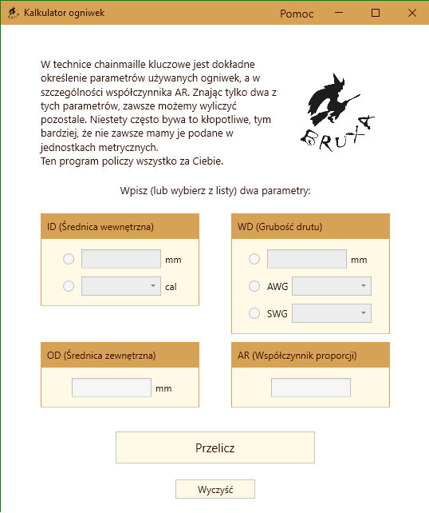
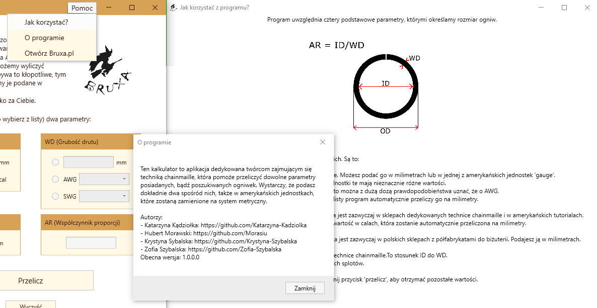

# Urania

Calculator of wire parameters developed for Bruxa Jewelry in order to simplify choosing the right material for chainmaille jewelry created using WPF, C# 9.0, and .Net 5.0.

# Features

### Usage

1. [Download file](https://github.com/MossPiglets/Urania/releases/download/v1.0.0/Kalkulator.Ogniwek.zip)
2. Unpack it
3. Choose file <b>Kalkulator Ogniwek</b>
4. Enjoy :)
# Authors

<b>MossPiglets</b> 
* [Hubert Morawski](https://github.com/Morasiu) 
* [Katarzyna Kądziołka](https://github.com/Katarzyna-Kadziolka) 
* [Krystyna Szybalska](https://github.com/Krystyna-Szybalska) 
* [Zofia Szybalska](https://github.com/Zofia-Szybalska)

### License
This project is licensed under the MIT License - see the [LICENSE](LICENSE) file for details

